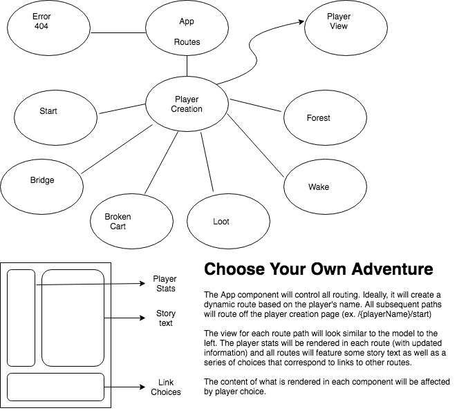
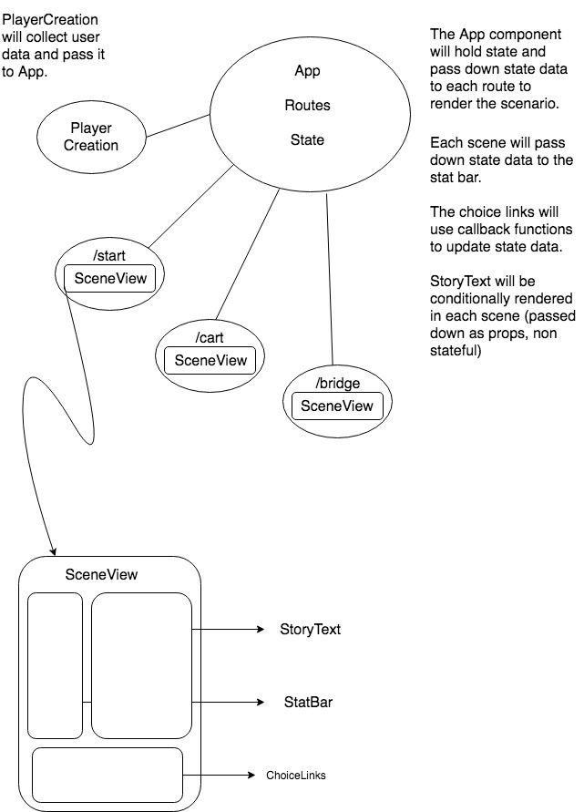

# Choose Your Own Adventure - React!


#### Names of Author
Chris Breaux

#### Date of Completion

4.19.2019

### Description

This project is an attempt to recreate an AngularJS project using React. The app is a choose your own adventure style adventure story. Users will make choices to resolve the story. In addition, a basic stats and inventory system will be included that will affect the choices and outcome of the story.

When creating this project in Angular, data was passed through the various components using two-way binding. In this react project (though there is only mock data currently) there should only be a single source of data that the entire project will have access to.

Additionally, I'm attempting a more modular design that will reuse components that will be re-rendered depending on the route the user takes.

### Planning




### Notes

* Generating components was much faster in Angular and I appreciated how everything was modularized from the get go.
* Styling wasn't as intuitive using React objects. Looking forward to implementing SCSS as well.
* How can I pass an object as a prop?
* Make a choice object that contains route info as well as description.
* How best to implement reusable functions so I don't have to recreate them on multiple components.

### Current Features

* Hardcoded player data

### Planned Features

* Player data collected from user input

### Known Bugs


### Technologies and Resources

* React
* CSS
* JSX
* Webpack
* Babel


### Responsiveness


### Setup Instructions

* Clone file from https://github.com/cjbreaux/cyoa-react.git
* Navigate to the cloned folder in the terminal.
* While in the project folder, run the following in the terminal:
 ```html
$ npm i
```
* After the files have downloaded, run the following:
```html
$ ng start
```

### Stretch Goals
* Remote storage of player data


### License

MIT License
